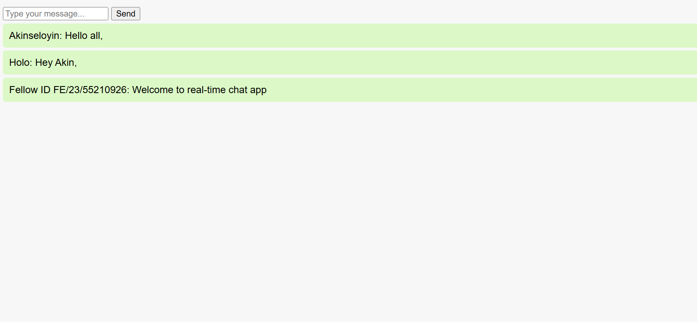

# Node.js Analysis Report
Node.js is a powerful runtime that enables developers to run JavaScript on the server side. This report explores how Node.js architecture supports scalability, its strengths and weaknesses, and showcases a real-time application that demonstrates these capabilities in practice.

## Table of Contents
- [1 Node.js Architecture](#1-nodejs-architecture)
  - [1.1 Event-Driven, Non-Blocking I/O Model](#11-event-driven-non-blocking-io-model)
  - [1.2 Single-Threaded Event Loop](#12-single-threaded-event-loop)
  - [1.3 Handling Concurrent Connections](#13-handling-concurrent-connections)
  - [1.4 Role of npm](#14-role-of-npm)
- [2. Scalability Features](#2-scalability-features)
- [3. Pros and Cons](#3-pros-and-cons)
  - [3.1 Pros of Node.js](#31-Pros-of-nodejs)
  - [3.2 Cons of Node.js](#32-cons-of-nodejs)
- [4. Practical Component: Real-Time Chat App](#4-practical-component-real-time-chat-app)
  -[4.1 Code Sample](#code-samples)
  -[4.2 Screenshot](#screenshot)
- [Author](#Author)


## 1. Node.js Architecture
The architecture of Node.js is built around several key components that enable its unique capabilities and performance. At its core, Node.js operates on _event-driven architecture, non-blocking, Single-Threaded Event Loop, Handling Concurrent Connections and the role of npm_.

#### 2.1 Event-Driven, Non-Blocking I/O Model
Enable the use of asynchronous callbacks, allowing the server to handle multiple tasks simultaneously without waiting for previous ones to complete.

#### 2.2 Single-Threaded Event Loop
Explain how the event loop works to handle requests in a non-blocking, efficient manner using a single thread.


#### 2.3 Handling Concurrent Connections
Discuss how Node.js manages concurrency with event listeners, worker threads, and libuv to handle thousands of simultaneous clients.

#### 2.4 Role of npm
Explain how npm provides access to an ecosystem of over a million packages, simplifying development and boosting productivity.


## 2. Scalability Features
***Comparison with Traditional Technologies***

|     __Feature__          |        __Node.js__               | __Traditional Backend (e.g., PHP, Java)__  |
|--------------------------|----------------------------------|--------------------------------------------|
| Concurrency              | Event loop + async I/O          | Threads or processes                        |
| Performance              | Lightweight, fast startup       | Heavyweight runtimes                        |
| Real-Time Support        | Native via Socket.IO            | Requires add-ons                            |
| Scalability Approach     | Horizontal scaling + clustering | Thread pools or application servers         |


## 3. Pros and Cons

#### 3.1 Pros of Node.js
- High performance via V8 engine
- Shared language across frontend and backend (JavaScript)
- Massive package ecosystem (npm)
- Real-time functionality via WebSockets
- Strong community and industry adoption (Netflix, LinkedIn, Uber)

#### 3.2 cons of Node.js
- Not ideal for CPU-heavy tasks
- Callback hell (though improved with `async/await`)
- Asynchronous error handling is more complex
- ORM challenges with complex relational databases


## 4. Practical Implementation: Real-Time Chat App
Summary:
- Built with Node.js, Express, and Socket.IO
- Frontend served with HTML/CSS
- WebSocket connection between clients and server
- Usernames prompt on join and displayed in chat messages

#### 4.1 Code Sample
`
public/index.html
```html
       <div id="chat-container">
         <ul id="messages">
            <form id="form" action="">
               <input id="input" autocomplete="off" placeholder="Type your message..." />
               <button>Send</button>
         </form>
      </ul>
   </div>
```

server/index.js
```js
   const { Socket } = require("dgram");
   const express = require("express");
   const http = require("http");
   const socketIO = require("socket.io");

   const app = express();
   const server = http.createServer(app);
   const io = socketIO(server);
```
`
#### 4.2 Screenshot



## Author
**Akinseloyin Holo**
**Fellow ID: FE/23/55210926**
Software Development
Cohort 3

